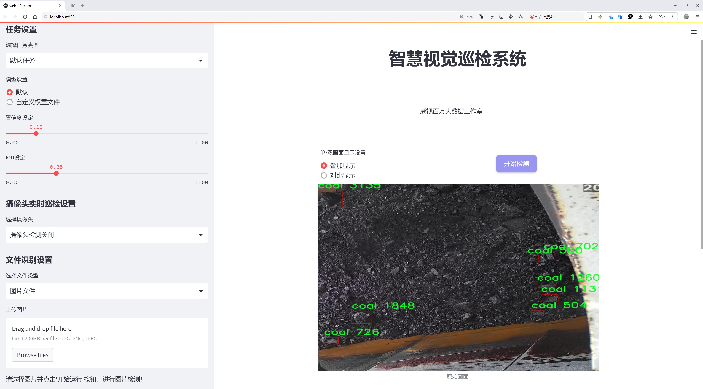
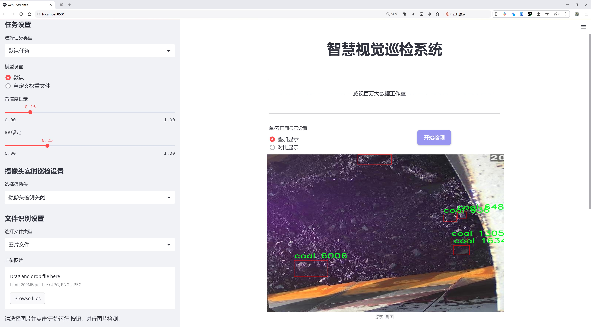
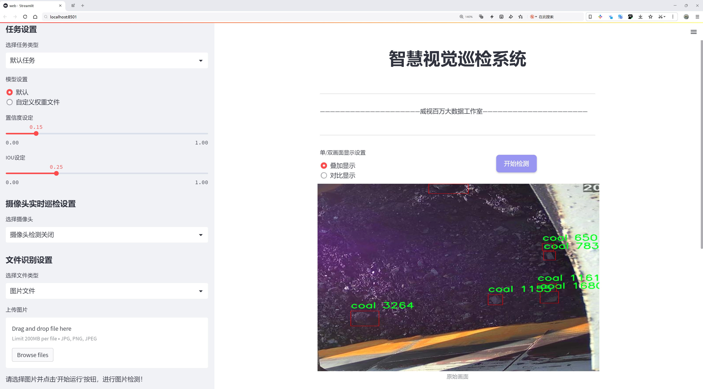
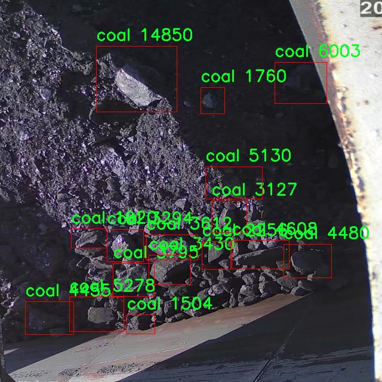
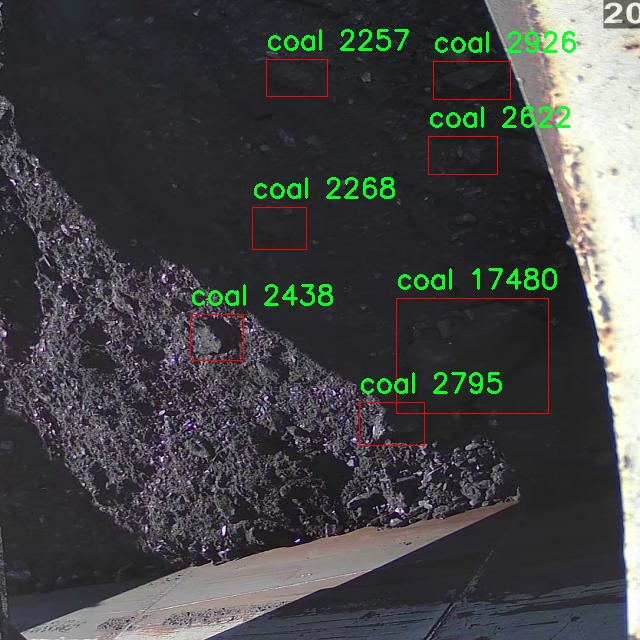
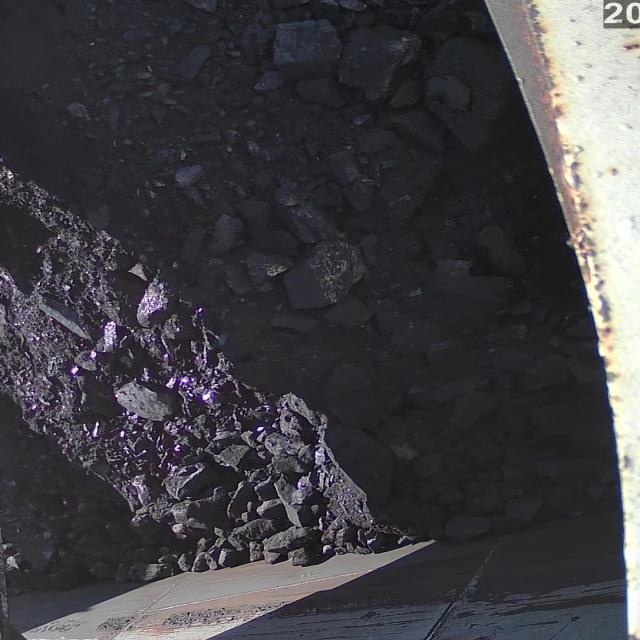
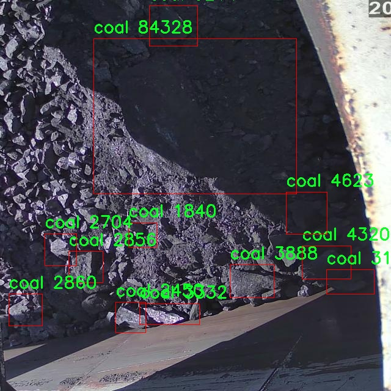
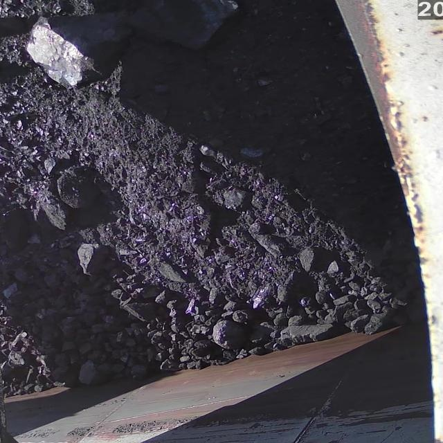

# 煤炭检测检测系统源码分享
 # [一条龙教学YOLOV8标注好的数据集一键训练_70+全套改进创新点发刊_Web前端展示]

### 1.研究背景与意义

项目参考[AAAI Association for the Advancement of Artificial Intelligence](https://gitee.com/qunshansj/projects)

项目来源[AACV Association for the Advancement of Computer Vision](https://gitee.com/qunmasj/projects)

研究背景与意义

随着全球能源结构的转型与可持续发展目标的推进，煤炭作为传统能源在全球范围内的使用仍然占据重要地位。然而，煤炭的开采、运输和使用过程中，存在着环境污染、资源浪费等诸多问题。因此，提升煤炭的检测与管理效率，成为了行业亟待解决的课题。近年来，计算机视觉技术的快速发展为煤炭检测提供了新的解决方案，尤其是基于深度学习的目标检测算法在图像识别领域展现出了优异的性能。YOLO（You Only Look Once）系列算法作为目标检测领域的代表性模型，以其高效性和实时性被广泛应用于各类视觉任务中。

在众多YOLO版本中，YOLOv8作为最新的改进版本，进一步提升了检测精度和速度，适用于复杂环境下的目标检测任务。针对煤炭检测这一特定应用场景，基于YOLOv8的改进模型将为煤炭的自动化检测提供更为可靠的技术支持。通过对煤炭图像的高效识别与分类，能够实现对煤炭资源的精准管理，减少人工干预，提高工作效率，降低人力成本。同时，改进YOLOv8模型的引入，能够有效提升煤炭检测的准确性，减少误检和漏检现象，为煤炭行业的智能化转型提供坚实的技术基础。

本研究所使用的数据集包含1900张煤炭图像，涵盖了多种不同的煤炭形态和环境背景。这一数据集的构建为模型的训练与验证提供了丰富的样本，有助于提高模型的泛化能力和适应性。通过对该数据集的深入分析与处理，研究者能够挖掘出煤炭图像中的潜在特征，从而为模型的优化提供数据支持。此外，单一类别的设置（即煤炭）使得模型在训练过程中能够集中精力于特定目标的检测，进一步提升检测的精度与效率。

在煤炭行业中，实时监测与自动化检测技术的应用不仅能够提高生产效率，还能有效降低安全隐患，促进环境保护。因此，基于改进YOLOv8的煤炭检测系统的研究，具有重要的理论意义与实际应用价值。通过本研究的开展，期望能够为煤炭行业的智能化发展提供新的思路与方法，推动相关技术的进步与应用。同时，本研究也为其他领域的目标检测提供了借鉴，展示了深度学习技术在特定行业应用中的广泛前景。

综上所述，基于改进YOLOv8的煤炭检测系统的研究，不仅是对现有技术的创新与提升，更是对煤炭行业可持续发展的一次积极探索。通过实现煤炭的高效检测与管理，能够为资源的合理利用与环境保护做出贡献，具有深远的社会与经济意义。

### 2.图片演示







##### 注意：由于此博客编辑较早，上面“2.图片演示”和“3.视频演示”展示的系统图片或者视频可能为老版本，新版本在老版本的基础上升级如下：（实际效果以升级的新版本为准）

  （1）适配了YOLOV8的“目标检测”模型和“实例分割”模型，通过加载相应的权重（.pt）文件即可自适应加载模型。

  （2）支持“图片识别”、“视频识别”、“摄像头实时识别”三种识别模式。

  （3）支持“图片识别”、“视频识别”、“摄像头实时识别”三种识别结果保存导出，解决手动导出（容易卡顿出现爆内存）存在的问题，识别完自动保存结果并导出到tempDir中。

  （4）支持Web前端系统中的标题、背景图等自定义修改，后面提供修改教程。

  另外本项目提供训练的数据集和训练教程,暂不提供权重文件（best.pt）,需要您按照教程进行训练后实现图片演示和Web前端界面演示的效果。

### 3.视频演示

[3.1 视频演示](https://www.bilibili.com/video/BV1D1taezESp/)

### 4.数据集信息展示

##### 4.1 本项目数据集详细数据（类别数＆类别名）

nc: 1
names: ['coal']


##### 4.2 本项目数据集信息介绍

数据集信息展示

在本研究中，我们使用了名为“fork”的数据集，以支持对改进YOLOv8模型的煤炭检测系统的训练和评估。该数据集专注于煤炭这一特定类别，具有极高的应用价值，尤其是在煤炭行业的自动化检测与监控方面。通过对该数据集的深入分析与应用，我们旨在提升YOLOv8在煤炭检测任务中的准确性和效率，从而为煤炭资源的管理和利用提供更为智能化的解决方案。

“fork”数据集的设计充分考虑了煤炭的特征和检测需求，数据集中仅包含一个类别，即“coal”。这一类别的单一性使得模型在训练过程中能够专注于煤炭的特征提取，避免了多类别之间的干扰。通过对大量煤炭图像的收集与标注，数据集涵盖了不同环境、不同光照条件下的煤炭样本。这种多样性确保了模型在实际应用中的鲁棒性，使其能够适应不同的工作场景。

在数据集的构建过程中，特别注重了图像的质量和多样性。我们收集了来自不同矿区、运输途径和存储环境的煤炭图像，确保了数据集的代表性。每张图像都经过精心标注，确保了模型在训练时能够准确识别煤炭的边界和特征。这种高质量的标注不仅提高了模型的学习效率，也为后续的评估提供了可靠的基准。

为了增强模型的泛化能力，我们还对数据集进行了多种数据增强处理。这包括随机裁剪、旋转、亮度调整等技术，以模拟不同的环境变化。这些数据增强手段不仅丰富了训练样本的多样性，还有效地减少了模型在特定条件下的过拟合风险。通过这种方式，我们希望提升YOLOv8在煤炭检测任务中的表现，使其能够在实际应用中更加精准地识别和定位煤炭。

在模型训练过程中，我们将“fork”数据集划分为训练集和验证集，以便于对模型的性能进行全面评估。训练集用于模型的学习，而验证集则用于监测模型的泛化能力和检测精度。通过对训练过程中的损失函数和精度指标的实时监控，我们能够及时调整模型参数，优化训练策略，确保最终模型的性能达到预期目标。

综上所述，“fork”数据集为改进YOLOv8的煤炭检测系统提供了坚实的基础。通过对煤炭这一特定类别的深入研究与分析，我们不仅提升了模型的检测能力，也为煤炭行业的智能化发展提供了有力支持。未来，我们期待在这一领域取得更大的突破，推动煤炭检测技术的进步与应用。











### 5.全套项目环境部署视频教程（零基础手把手教学）

[5.1 环境部署教程链接（零基础手把手教学）](https://www.ixigua.com/7404473917358506534?logTag=c807d0cbc21c0ef59de5)


[5.2 安装Python虚拟环境创建和依赖库安装视频教程链接（零基础手把手教学）](https://www.ixigua.com/7404474678003106304?logTag=1f1041108cd1f708b01a)

### 6.手把手YOLOV8训练视频教程（零基础小白有手就能学会）

[6.1 手把手YOLOV8训练视频教程（零基础小白有手就能学会）](https://www.ixigua.com/7404477157818401292?logTag=d31a2dfd1983c9668658)

### 7.70+种全套YOLOV8创新点代码加载调参视频教程（一键加载写好的改进模型的配置文件）

[7.1 70+种全套YOLOV8创新点代码加载调参视频教程（一键加载写好的改进模型的配置文件）](https://www.ixigua.com/7404478314661806627?logTag=29066f8288e3f4eea3a4)

### 8.70+种全套YOLOV8创新点原理讲解（非科班也可以轻松写刊发刊，V10版本正在科研待更新）

由于篇幅限制，每个创新点的具体原理讲解就不一一展开，具体见下列网址中的创新点对应子项目的技术原理博客网址【Blog】：


[8.1 70+种全套YOLOV8创新点原理讲解链接](https://gitee.com/qunmasj/good)

### 9.系统功能展示（检测对象为举例，实际内容以本项目数据集为准）

图9.1.系统支持检测结果表格显示

  图9.2.系统支持置信度和IOU阈值手动调节

  图9.3.系统支持自定义加载权重文件best.pt(需要你通过步骤5中训练获得)

  图9.4.系统支持摄像头实时识别

  图9.5.系统支持图片识别

  图9.6.系统支持视频识别

  图9.7.系统支持识别结果文件自动保存

  图9.8.系统支持Excel导出检测结果数据


### 10.原始YOLOV8算法原理

原始YOLOv8算法原理

YOLO（You Only Look Once）系列算法自其诞生以来便以其高效的目标检测能力而广受关注，YOLOv8作为该系列的最新版本，进一步提升了检测精度和速度，展现出强大的应用潜力。YOLOv8的设计理念是将目标检测任务简化为一个回归问题，通过单一的神经网络实现对图像中目标的定位和分类。其架构主要由输入层、Backbone骨干网络、Neck特征融合网络和Head检测模块四个部分组成，每一部分都经过精心设计，以优化整体性能。

在输入层，YOLOv8采用640x640的标准图像尺寸进行处理，然而在实际应用中，图像的长宽比往往各不相同。为了解决这一问题，YOLOv8引入了自适应图像缩放技术。这一技术的核心在于将图像的长边按比例缩小至指定尺寸，然后对短边进行填充，以尽量减少信息冗余，保持目标的完整性。此外，YOLOv8在训练过程中采用了Mosaic增强技术，通过将四张随机选择的图像进行缩放和拼接，生成新的训练样本。这种方法不仅提高了模型对不同位置和周围像素的适应能力，还有效提升了预测精度。

Backbone部分是YOLOv8的特征提取核心，采用了一系列卷积和反卷积层来提取图像特征。与之前版本不同，YOLOv8在此部分引入了C2f模块，替代了YOLOv5中的C3模块。C2f模块通过并行化更多的梯度流分支，确保了特征提取的丰富性，同时保持了网络的轻量化。这一设计使得YOLOv8能够在不同规模的模型中灵活调整通道数，从而获得更为丰富的梯度流动信息。此外，SPPF（快速空间金字塔池化）模块的引入，进一步增强了特征图的处理能力，通过不同内核尺寸的池化操作合并特征图，为后续的特征融合奠定了基础。

在Neck部分，YOLOv8继续采用双塔结构，通过特征金字塔和路径聚合网络的结合，促进了语义特征和定位特征的有效转移。这一设计使得模型能够更好地捕捉不同尺度目标的信息，从而提高了目标检测的性能和鲁棒性。Neck部分的改进不仅提升了特征融合的能力，还增强了对多尺度目标的检测能力，使得YOLOv8在复杂场景下的表现更加出色。

Head模块是YOLOv8的检测核心，负责最终的目标检测和分类任务。与之前的Coupled-Head结构不同，YOLOv8采用了Decoupled-Head结构，将检测和分类的卷积操作分开进行。这一改进使得模型在处理目标时能够更为专注，减少了任务之间的干扰。具体而言，输入的特征图首先通过两个1x1的卷积模块进行降维，然后分别进入两个分支，一个用于类别预测，另一个用于边界框位置和IoU（交并比）预测。这种解耦设计有效提升了模型的学习效率和预测精度。

值得注意的是，YOLOv8在损失函数的设计上也进行了创新，取消了Obj分支，采用BCELoss（Binary Cross Entropy Loss）和DFL（Distribution Focal Loss）结合CIoULoss（Complete Intersection over Union Loss）的方法。这一设计旨在使网络模型能够快速聚焦于标签附近的数值，提高预测的准确性。此外，YOLOv8抛弃了传统的Anchor-Based方法，转而采用Anchor-Free的策略，将目标检测转化为关键点检测。这一变化不仅简化了网络结构，还提高了模型的泛化能力，使其在处理不同数据集时表现更加灵活。

总的来说，YOLOv8通过一系列创新和改进，进一步提升了目标检测的效率和准确性。其在Backbone、Neck和Head模块的设计上都体现了对特征提取、融合和检测的深刻理解，使得YOLOv8在复杂场景下的表现更加卓越。随着YOLOv8的推广和应用，未来在智能监控、自动驾驶、医疗影像等领域，必将发挥出更大的潜力。


### 11.项目核心源码讲解（再也不用担心看不懂代码逻辑）

#### 11.1 code\ultralytics\models\yolo\segment\val.py

以下是对给定代码的核心部分进行提炼和详细注释的结果：

```python
# 导入必要的库
from multiprocessing.pool import ThreadPool
from pathlib import Path
import numpy as np
import torch
import torch.nn.functional as F
from ultralytics.models.yolo.detect import DetectionValidator
from ultralytics.utils import LOGGER, NUM_THREADS, ops
from ultralytics.utils.checks import check_requirements
from ultralytics.utils.metrics import SegmentMetrics, box_iou, mask_iou
from ultralytics.utils.plotting import output_to_target, plot_images

class SegmentationValidator(DetectionValidator):
    """
    扩展自DetectionValidator类，用于基于分割模型的验证。
    """

    def __init__(self, dataloader=None, save_dir=None, pbar=None, args=None, _callbacks=None):
        """初始化SegmentationValidator并将任务设置为'segment'，度量标准设置为SegmentMetrics。"""
        super().__init__(dataloader, save_dir, pbar, args, _callbacks)
        self.plot_masks = None  # 用于存储绘图的掩码
        self.process = None  # 处理掩码的函数
        self.args.task = "segment"  # 设置任务类型为分割
        self.metrics = SegmentMetrics(save_dir=self.save_dir, on_plot=self.on_plot)  # 初始化度量标准

    def preprocess(self, batch):
        """预处理批次，将掩码转换为浮点数并发送到设备。"""
        batch = super().preprocess(batch)  # 调用父类的预处理方法
        batch["masks"] = batch["masks"].to(self.device).float()  # 将掩码转移到设备并转换为浮点数
        return batch

    def postprocess(self, preds):
        """后处理YOLO预测，返回输出检测和原型。"""
        p = ops.non_max_suppression(
            preds[0],
            self.args.conf,
            self.args.iou,
            labels=self.lb,
            multi_label=True,
            agnostic=self.args.single_cls,
            max_det=self.args.max_det,
            nc=self.nc,
        )  # 应用非极大值抑制
        proto = preds[1][-1] if len(preds[1]) == 3 else preds[1]  # 获取原型
        return p, proto  # 返回处理后的预测和原型

    def update_metrics(self, preds, batch):
        """更新度量标准。"""
        for si, (pred, proto) in enumerate(zip(preds[0], preds[1])):
            self.seen += 1  # 记录已处理的样本数量
            npr = len(pred)  # 当前预测的数量
            stat = dict(
                conf=torch.zeros(0, device=self.device),
                pred_cls=torch.zeros(0, device=self.device),
                tp=torch.zeros(npr, self.niou, dtype=torch.bool, device=self.device),
                tp_m=torch.zeros(npr, self.niou, dtype=torch.bool, device=self.device),
            )
            pbatch = self._prepare_batch(si, batch)  # 准备批次
            cls, bbox = pbatch.pop("cls"), pbatch.pop("bbox")  # 获取类别和边界框
            nl = len(cls)  # 目标数量
            stat["target_cls"] = cls  # 记录目标类别

            if npr == 0:  # 如果没有预测
                if nl:
                    for k in self.stats.keys():
                        self.stats[k].append(stat[k])  # 更新统计信息
                continue

            gt_masks = pbatch.pop("masks")  # 获取真实掩码
            predn, pred_masks = self._prepare_pred(pred, pbatch, proto)  # 准备预测
            stat["conf"] = predn[:, 4]  # 置信度
            stat["pred_cls"] = predn[:, 5]  # 预测类别

            if nl:  # 如果有目标
                stat["tp"] = self._process_batch(predn, bbox, cls)  # 处理边界框
                stat["tp_m"] = self._process_batch(
                    predn, bbox, cls, pred_masks, gt_masks, self.args.overlap_mask, masks=True
                )  # 处理掩码

            for k in self.stats.keys():
                self.stats[k].append(stat[k])  # 更新统计信息

    def _process_batch(self, detections, gt_bboxes, gt_cls, pred_masks=None, gt_masks=None, overlap=False, masks=False):
        """
        返回正确的预测矩阵。
        """
        if masks:
            # 处理掩码的逻辑
            if overlap:
                nl = len(gt_cls)
                index = torch.arange(nl, device=gt_masks.device).view(nl, 1, 1) + 1
                gt_masks = gt_masks.repeat(nl, 1, 1)  # 重复掩码以匹配目标数量
                gt_masks = torch.where(gt_masks == index, 1.0, 0.0)  # 生成掩码
            if gt_masks.shape[1:] != pred_masks.shape[1:]:
                gt_masks = F.interpolate(gt_masks[None], pred_masks.shape[1:], mode="bilinear", align_corners=False)[0]
                gt_masks = gt_masks.gt_(0.5)  # 进行插值
            iou = mask_iou(gt_masks.view(gt_masks.shape[0], -1), pred_masks.view(pred_masks.shape[0], -1))  # 计算IoU
        else:  # 处理边界框
            iou = box_iou(gt_bboxes, detections[:, :4])  # 计算边界框的IoU

        return self.match_predictions(detections[:, 5], gt_cls, iou)  # 匹配预测和真实值

    def plot_predictions(self, batch, preds, ni):
        """绘制批次预测，包括掩码和边界框。"""
        plot_images(
            batch["img"],
            *output_to_target(preds[0], max_det=15),  # 绘制预测
            torch.cat(self.plot_masks, dim=0) if len(self.plot_masks) else self.plot_masks,
            paths=batch["im_file"],
            fname=self.save_dir / f"val_batch{ni}_pred.jpg",
            names=self.names,
            on_plot=self.on_plot,
        )  # 绘制结果
        self.plot_masks.clear()  # 清空绘图掩码

    def eval_json(self, stats):
        """返回COCO风格的目标检测评估指标。"""
        if self.args.save_json and self.is_coco and len(self.jdict):
            anno_json = self.data["path"] / "annotations/instances_val2017.json"  # 注释文件路径
            pred_json = self.save_dir / "predictions.json"  # 预测文件路径
            LOGGER.info(f"\nEvaluating pycocotools mAP using {pred_json} and {anno_json}...")
            try:
                check_requirements("pycocotools>=2.0.6")  # 检查依赖
                from pycocotools.coco import COCO  # 导入COCO API
                from pycocotools.cocoeval import COCOeval  # 导入COCO评估API

                for x in anno_json, pred_json:
                    assert x.is_file(), f"{x} file not found"  # 确保文件存在
                anno = COCO(str(anno_json))  # 初始化注释API
                pred = anno.loadRes(str(pred_json))  # 加载预测结果
                for i, eval in enumerate([COCOeval(anno, pred, "bbox"), COCOeval(anno, pred, "segm")]):
                    if self.is_coco:
                        eval.params.imgIds = [int(Path(x).stem) for x in self.dataloader.dataset.im_files]  # 设置评估图像ID
                    eval.evaluate()  # 评估
                    eval.accumulate()  # 累计结果
                    eval.summarize()  # 总结结果
                    idx = i * 4 + 2
                    stats[self.metrics.keys[idx + 1]], stats[self.metrics.keys[idx]] = eval.stats[:2]  # 更新mAP指标
            except Exception as e:
                LOGGER.warning(f"pycocotools unable to run: {e}")  # 处理异常
        return stats  # 返回统计信息
```

### 代码分析
1. **类 SegmentationValidator**: 这是一个用于分割模型验证的类，继承自 `DetectionValidator`。它重写了一些方法以适应分割任务的需求。
2. **初始化方法**: 在初始化时设置任务类型为分割，并初始化度量标准。
3. **预处理和后处理**: 预处理方法将掩码转换为浮点数并转移到设备上，后处理方法则应用非极大值抑制以获得最终的预测结果。
4. **更新度量标准**: 该方法在每个批次中更新统计信息，包括计算IoU和匹配预测与真实标签。
5. **绘图方法**: 包含绘制预测结果和验证样本的功能，便于可视化模型的性能。
6. **评估方法**: 使用COCO API评估模型的性能，计算mAP等指标。

通过以上注释和分析，可以更好地理解该代码的核心功能和结构。

这个文件是一个用于YOLO（You Only Look Once）模型的分割验证器的实现，主要用于对分割模型的验证过程进行管理和评估。它继承自`DetectionValidator`类，专门处理分割任务。代码中定义了多个方法，负责数据的预处理、后处理、指标的计算以及结果的可视化等。

在初始化时，`SegmentationValidator`类设置了任务类型为“segment”，并初始化了一些用于计算分割指标的对象，如`SegmentMetrics`。在数据预处理阶段，输入的批次数据中的掩码被转换为浮点数并发送到指定的设备（如GPU）。此外，根据是否需要保存JSON格式的结果，选择不同的掩码处理函数，以提高处理的准确性或速度。

在后处理阶段，模型的预测结果经过非极大值抑制（NMS）处理，以减少重叠的检测框。然后根据模型的输出，准备训练或推理所需的批次数据，并进行预测的准备工作。对于每个批次，计算真实目标与预测结果之间的匹配情况，并更新统计信息，包括正确预测的数量、置信度、类别等。

在更新指标的过程中，代码处理了真实掩码和预测掩码之间的IoU（Intersection over Union）计算，以评估分割的准确性。对于每个批次，绘制预测结果和真实标签的可视化图像，并根据需要保存预测结果为JSON格式。

最后，`eval_json`方法用于评估COCO格式的目标检测指标，使用pycocotools库来计算mAP（mean Average Precision）等指标。该方法会加载真实的标注数据和预测结果，并进行评估。

整体来看，这个文件实现了一个完整的分割模型验证流程，包括数据的预处理、模型的推理、结果的后处理和评估，能够有效地帮助开发者评估分割模型的性能。

#### 11.2 code\ultralytics\utils\tal.py

以下是代码中最核心的部分，并附上详细的中文注释：

```python
import torch
import torch.nn as nn

class TaskAlignedAssigner(nn.Module):
    """
    任务对齐分配器，用于目标检测。

    该类根据任务对齐指标将真实目标（gt）分配给锚点，该指标结合了分类和定位信息。

    属性：
        topk (int): 考虑的前k个候选项数量。
        num_classes (int): 目标类别的数量。
        alpha (float): 任务对齐指标分类部分的alpha参数。
        beta (float): 任务对齐指标定位部分的beta参数。
        eps (float): 防止除以零的小值。
    """

    def __init__(self, topk=13, num_classes=80, alpha=1.0, beta=6.0, eps=1e-9):
        """初始化任务对齐分配器对象，设置可调超参数。"""
        super().__init__()
        self.topk = topk  # 前k个候选项
        self.num_classes = num_classes  # 类别数量
        self.bg_idx = num_classes  # 背景索引
        self.alpha = alpha  # 分类部分的权重
        self.beta = beta  # 定位部分的权重
        self.eps = eps  # 防止除零的小值

    @torch.no_grad()
    def forward(self, pd_scores, pd_bboxes, anc_points, gt_labels, gt_bboxes, mask_gt):
        """
        计算任务对齐分配。

        参数：
            pd_scores (Tensor): 预测分数，形状为(bs, num_total_anchors, num_classes)
            pd_bboxes (Tensor): 预测边界框，形状为(bs, num_total_anchors, 4)
            anc_points (Tensor): 锚点坐标，形状为(num_total_anchors, 2)
            gt_labels (Tensor): 真实标签，形状为(bs, n_max_boxes, 1)
            gt_bboxes (Tensor): 真实边界框，形状为(bs, n_max_boxes, 4)
            mask_gt (Tensor): 真实目标掩码，形状为(bs, n_max_boxes, 1)

        返回：
            target_labels (Tensor): 目标标签，形状为(bs, num_total_anchors)
            target_bboxes (Tensor): 目标边界框，形状为(bs, num_total_anchors, 4)
            target_scores (Tensor): 目标分数，形状为(bs, num_total_anchors, num_classes)
            fg_mask (Tensor): 前景掩码，形状为(bs, num_total_anchors)
            target_gt_idx (Tensor): 目标真实索引，形状为(bs, num_total_anchors)
        """
        self.bs = pd_scores.size(0)  # 批量大小
        self.n_max_boxes = gt_bboxes.size(1)  # 最大边界框数量

        if self.n_max_boxes == 0:  # 如果没有真实目标
            device = gt_bboxes.device
            return (
                torch.full_like(pd_scores[..., 0], self.bg_idx).to(device),  # 返回背景标签
                torch.zeros_like(pd_bboxes).to(device),  # 返回零边界框
                torch.zeros_like(pd_scores).to(device),  # 返回零分数
                torch.zeros_like(pd_scores[..., 0]).to(device),  # 返回零前景掩码
                torch.zeros_like(pd_scores[..., 0]).to(device),  # 返回零目标索引
            )

        # 获取正样本掩码、对齐指标和重叠度
        mask_pos, align_metric, overlaps = self.get_pos_mask(
            pd_scores, pd_bboxes, gt_labels, gt_bboxes, anc_points, mask_gt
        )

        # 选择重叠度最高的目标
        target_gt_idx, fg_mask, mask_pos = self.select_highest_overlaps(mask_pos, overlaps, self.n_max_boxes)

        # 获取目标标签、边界框和分数
        target_labels, target_bboxes, target_scores = self.get_targets(gt_labels, gt_bboxes, target_gt_idx, fg_mask)

        # 归一化对齐指标
        align_metric *= mask_pos
        pos_align_metrics = align_metric.amax(dim=-1, keepdim=True)  # 计算每个样本的最大对齐指标
        pos_overlaps = (overlaps * mask_pos).amax(dim=-1, keepdim=True)  # 计算每个样本的最大重叠度
        norm_align_metric = (align_metric * pos_overlaps / (pos_align_metrics + self.eps)).amax(-2).unsqueeze(-1)
        target_scores = target_scores * norm_align_metric  # 更新目标分数

        return target_labels, target_bboxes, target_scores, fg_mask.bool(), target_gt_idx

    def get_pos_mask(self, pd_scores, pd_bboxes, gt_labels, gt_bboxes, anc_points, mask_gt):
        """获取正样本掩码，形状为(b, max_num_obj, h*w)。"""
        mask_in_gts = self.select_candidates_in_gts(anc_points, gt_bboxes)  # 选择在真实目标中的候选锚点
        align_metric, overlaps = self.get_box_metrics(pd_scores, pd_bboxes, gt_labels, gt_bboxes, mask_in_gts * mask_gt)  # 计算对齐指标和重叠度
        mask_topk = self.select_topk_candidates(align_metric, topk_mask=mask_gt.expand(-1, -1, self.topk).bool())  # 选择前k个候选
        mask_pos = mask_topk * mask_in_gts * mask_gt  # 合并所有掩码

        return mask_pos, align_metric, overlaps

    def get_box_metrics(self, pd_scores, pd_bboxes, gt_labels, gt_bboxes, mask_gt):
        """计算给定预测和真实边界框的对齐指标。"""
        na = pd_bboxes.shape[-2]  # 锚点数量
        mask_gt = mask_gt.bool()  # 转换为布尔类型
        overlaps = torch.zeros([self.bs, self.n_max_boxes, na], dtype=pd_bboxes.dtype, device=pd_bboxes.device)  # 初始化重叠度
        bbox_scores = torch.zeros([self.bs, self.n_max_boxes, na], dtype=pd_scores.dtype, device=pd_scores.device)  # 初始化边界框分数

        ind = torch.zeros([2, self.bs, self.n_max_boxes], dtype=torch.long)  # 创建索引
        ind[0] = torch.arange(end=self.bs).view(-1, 1).expand(-1, self.n_max_boxes)  # 批量索引
        ind[1] = gt_labels.squeeze(-1)  # 真实标签索引
        bbox_scores[mask_gt] = pd_scores[ind[0], :, ind[1]][mask_gt]  # 获取每个网格的分数

        # 计算重叠度
        pd_boxes = pd_bboxes.unsqueeze(1).expand(-1, self.n_max_boxes, -1, -1)[mask_gt]  # 扩展预测边界框
        gt_boxes = gt_bboxes.unsqueeze(2).expand(-1, -1, na, -1)[mask_gt]  # 扩展真实边界框
        overlaps[mask_gt] = self.iou_calculation(gt_boxes, pd_boxes)  # 计算IoU

        align_metric = bbox_scores.pow(self.alpha) * overlaps.pow(self.beta)  # 计算对齐指标
        return align_metric, overlaps

    def iou_calculation(self, gt_bboxes, pd_bboxes):
        """计算水平边界框的IoU。"""
        return bbox_iou(gt_bboxes, pd_bboxes, xywh=False, CIoU=True).squeeze(-1).clamp_(0)  # 计算IoU并限制在0到1之间

    def select_topk_candidates(self, metrics, largest=True, topk_mask=None):
        """
        根据给定指标选择前k个候选项。

        参数：
            metrics (Tensor): 形状为(b, max_num_obj, h*w)的张量，b为批量大小，max_num_obj为最大目标数量，h*w为锚点总数。
            largest (bool): 如果为True，选择最大的值；否则，选择最小的值。
            topk_mask (Tensor): 可选的布尔张量，形状为(b, max_num_obj, topk)。

        返回：
            (Tensor): 形状为(b, max_num_obj, h*w)的张量，包含所选的前k个候选项。
        """
        topk_metrics, topk_idxs = torch.topk(metrics, self.topk, dim=-1, largest=largest)  # 获取前k个指标和索引
        if topk_mask is None:
            topk_mask = (topk_metrics.max(-1, keepdim=True)[0] > self.eps).expand_as(topk_idxs)  # 生成掩码
        topk_idxs.masked_fill_(~topk_mask, 0)  # 用0填充无效索引

        count_tensor = torch.zeros(metrics.shape, dtype=torch.int8, device=topk_idxs.device)  # 初始化计数张量
        ones = torch.ones_like(topk_idxs[:, :, :1], dtype=torch.int8, device=topk_idxs.device)  # 创建全1张量
        for k in range(self.topk):
            count_tensor.scatter_add_(-1, topk_idxs[:, :, k : k + 1], ones)  # 统计每个索引的出现次数
        count_tensor.masked_fill_(count_tensor > 1, 0)  # 过滤无效边界框

        return count_tensor.to(metrics.dtype)  # 返回计数张量

    def get_targets(self, gt_labels, gt_bboxes, target_gt_idx, fg_mask):
        """
        计算正锚点的目标标签、目标边界框和目标分数。

        参数：
            gt_labels (Tensor): 真实标签，形状为(b, max_num_obj, 1)。
            gt_bboxes (Tensor): 真实边界框，形状为(b, max_num_obj, 4)。
            target_gt_idx (Tensor): 正锚点分配的真实目标索引，形状为(b, h*w)。
            fg_mask (Tensor): 布尔张量，形状为(b, h*w)，指示正锚点。

        返回：
            (Tuple[Tensor, Tensor, Tensor]): 包含以下张量的元组：
                - target_labels (Tensor): 形状为(b, h*w)，包含正锚点的目标标签。
                - target_bboxes (Tensor): 形状为(b, h*w, 4)，包含正锚点的目标边界框。
                - target_scores (Tensor): 形状为(b, h*w, num_classes)，包含正锚点的目标分数。
        """
        batch_ind = torch.arange(end=self.bs, dtype=torch.int64, device=gt_labels.device)[..., None]  # 批量索引
        target_gt_idx = target_gt_idx + batch_ind * self.n_max_boxes  # 计算目标索引
        target_labels = gt_labels.long().flatten()[target_gt_idx]  # 获取目标标签

        target_bboxes = gt_bboxes.view(-1, gt_bboxes.shape[-1])[target_gt_idx]  # 获取目标边界框

        target_labels.clamp_(0)  # 限制标签在有效范围内

        target_scores = torch.zeros(
            (target_labels.shape[0], target_labels.shape[1], self.num_classes),
            dtype=torch.int64,
            device=target_labels.device,
        )  # 初始化目标分数
        target_scores.scatter_(2, target_labels.unsqueeze(-1), 1)  # 将目标标签转换为one-hot编码

        fg_scores_mask = fg_mask[:, :, None].repeat(1, 1, self.num_classes)  # 扩展前景掩码
        target_scores = torch.where(fg_scores_mask > 0, target_scores, 0)  # 仅保留正锚点的分数

        return target_labels, target_bboxes, target_scores  # 返回目标标签、边界框和分数

    @staticmethod
    def select_candidates_in_gts(xy_centers, gt_bboxes, eps=1e-9):
        """
        选择在真实目标中的正锚点中心。

        参数：
            xy_centers (Tensor): 形状为(h*w, 2)的张量
            gt_bboxes (Tensor): 形状为(b, n_boxes, 4)的张量

        返回：
            (Tensor): 形状为(b, n_boxes, h*w)的张量
        """
        n_anchors = xy_centers.shape[0]  # 锚点数量
        bs, n_boxes, _ = gt_bboxes.shape  # 批量大小和真实目标数量
        lt, rb = gt_bboxes.view(-1, 1, 4).chunk(2, 2)  # 左上角和右下角
        bbox_deltas = torch.cat((xy_centers[None] - lt, rb - xy_centers[None]), dim=2).view(bs, n_boxes, n_anchors, -1)  # 计算边界框的偏差
        return bbox_deltas.amin(3).gt_(eps)  # 返回在真实目标内的锚点

    @staticmethod
    def select_highest_overlaps(mask_pos, overlaps, n_max_boxes):
        """
        如果一个锚框分配给多个真实目标，则选择重叠度最高的一个。

        参数：
            mask_pos (Tensor): 形状为(b, n_max_boxes, h*w)
            overlaps (Tensor): 形状为(b, n_max_boxes, h*w)

        返回：
            target_gt_idx (Tensor): 形状为(b, h*w)
            fg_mask (Tensor): 形状为(b, h*w)
            mask_pos (Tensor): 形状为(b, n_max_boxes, h*w)
        """
        fg_mask = mask_pos.sum(-2)  # 计算前景掩码
        if fg_mask.max() > 1:  # 如果一个锚点分配给多个真实目标
            mask_multi_gts = (fg_mask.unsqueeze(1) > 1).expand(-1, n_max_boxes, -1)  # 生成多目标掩码
            max_overlaps_idx = overlaps.argmax(1)  # 获取最大重叠度的索引

            is_max_overlaps = torch.zeros(mask_pos.shape, dtype=mask_pos.dtype, device=mask_pos.device)  # 初始化最大重叠度掩码
            is_max_overlaps.scatter_(1, max_overlaps_idx.unsqueeze(1), 1)  # 标记最大重叠度的索引

            mask_pos = torch.where(mask_multi_gts, is_max_overlaps, mask_pos).float()  # 更新掩码
            fg_mask = mask_pos.sum(-2)  # 更新前景掩码
        target_gt_idx = mask_pos.argmax(-2)  # 获取每个网格对应的真实目标索引
        return target_gt_idx, fg_mask, mask_pos  # 返回目标索引、前景掩码和正样本掩码
```

这段代码实现了一个任务对齐分配器，用于目标检测中的锚点与真实目标的匹配。它通过计算对齐指标和重叠度来选择最佳的锚点，并生成相应的目标标签、边界框和分数。

这个程序文件是一个用于目标检测的任务对齐分配器（TaskAlignedAssigner），它主要负责将真实目标（ground-truth）与锚框（anchors）进行匹配，以便于后续的目标检测任务。该类继承自PyTorch的`nn.Module`，并使用了一些自定义的指标和操作来实现这一功能。

在初始化方法中，`TaskAlignedAssigner`接受一些超参数，包括考虑的候选框数量（topk）、类别数量（num_classes）、分类和定位的权重参数（alpha和beta），以及一个小的epsilon值用于防止除零错误。`bg_idx`用于表示背景类别的索引。

`forward`方法是该类的核心功能，它接收一系列输入，包括预测的分数、边界框、锚点、真实标签和边界框等。该方法首先检查是否有真实目标，如果没有，则返回背景标签和零值的边界框和分数。接着，它通过调用`get_pos_mask`方法计算出正样本的掩码、对齐指标和重叠度。然后，利用`select_highest_overlaps`方法选择具有最高重叠度的锚框，并通过`get_targets`方法获取目标标签、边界框和分数。最后，返回这些计算结果。

`get_pos_mask`方法用于获取正样本的掩码，它通过选择在真实目标内的候选框，并计算对齐指标和重叠度来实现。`get_box_metrics`方法则计算预测框和真实框之间的对齐指标，使用了IoU（Intersection over Union）作为评估标准。`iou_calculation`方法具体实现了IoU的计算，支持普通和旋转边界框的计算。

`select_topk_candidates`方法用于根据给定的指标选择前k个候选框，确保每个锚框只分配给一个真实目标。`get_targets`方法计算正样本的目标标签、边界框和分数。

此外，文件中还定义了一个`RotatedTaskAlignedAssigner`类，专门处理旋转边界框的情况，重写了IoU计算和候选框选择的方法。

最后，文件中还包含了一些辅助函数，例如`make_anchors`用于生成锚框，`dist2bbox`和`bbox2dist`用于在锚框和边界框之间进行转换，`dist2rbox`用于解码预测的旋转边界框坐标。

整体而言，这个文件实现了一个复杂的目标检测锚框分配机制，结合了分类和定位信息，旨在提高目标检测模型的性能。

#### 11.3 ui.py

```python
import sys
import subprocess

def run_script(script_path):
    """
    使用当前 Python 环境运行指定的脚本。

    Args:
        script_path (str): 要运行的脚本路径

    Returns:
        None
    """
    # 获取当前 Python 解释器的路径
    python_path = sys.executable

    # 构建运行命令
    command = f'"{python_path}" -m streamlit run "{script_path}"'

    # 执行命令
    result = subprocess.run(command, shell=True)
    if result.returncode != 0:
        print("脚本运行出错。")


# 实例化并运行应用
if __name__ == "__main__":
    # 指定您的脚本路径
    script_path = "web.py"  # 这里直接指定脚本路径

    # 运行脚本
    run_script(script_path)
```

### 代码注释说明：

1. **导入模块**：
   - `import sys`：导入 sys 模块，用于访问与 Python 解释器相关的变量和函数。
   - `import subprocess`：导入 subprocess 模块，用于执行外部命令。

2. **定义函数 `run_script`**：
   - `def run_script(script_path):`：定义一个函数，接受一个参数 `script_path`，表示要运行的脚本路径。

3. **获取 Python 解释器路径**：
   - `python_path = sys.executable`：获取当前 Python 解释器的完整路径，以便后续执行脚本时使用。

4. **构建运行命令**：
   - `command = f'"{python_path}" -m streamlit run "{script_path}"'`：构建一个命令字符串，使用 Python 解释器运行 `streamlit` 模块，并指定要运行的脚本。

5. **执行命令**：
   - `result = subprocess.run(command, shell=True)`：使用 subprocess.run() 执行构建的命令。`shell=True` 允许在 shell 中执行命令。

6. **检查命令执行结果**：
   - `if result.returncode != 0:`：检查命令的返回码，如果不为 0，表示执行出错。
   - `print("脚本运行出错。")`：输出错误信息。

7. **主程序入口**：
   - `if __name__ == "__main__":`：确保该代码块仅在直接运行该脚本时执行，而不是在被导入时执行。
   - `script_path = "web.py"`：指定要运行的脚本路径。
   - `run_script(script_path)`：调用 `run_script` 函数，传入脚本路径以执行该脚本。

这个程序文件名为 `ui.py`，其主要功能是通过当前的 Python 环境来运行一个指定的脚本，具体是一个名为 `web.py` 的文件。程序首先导入了必要的模块，包括 `sys`、`os` 和 `subprocess`，以及一个自定义的路径处理函数 `abs_path`。

在 `run_script` 函数中，首先获取当前 Python 解释器的路径，这样可以确保使用正确的 Python 环境来执行脚本。接着，构建一个命令字符串，这个命令使用 `streamlit` 模块来运行指定的脚本。`streamlit` 是一个用于构建数据应用的库，通常用于快速开发和展示数据可视化应用。

然后，使用 `subprocess.run` 方法来执行构建好的命令。这个方法会在一个新的 shell 中运行命令，并等待其完成。如果脚本运行过程中出现错误，返回的状态码 `returncode` 将不为零，此时程序会打印出“脚本运行出错”的提示信息。

在文件的最后部分，使用 `if __name__ == "__main__":` 语句来确保当这个文件作为主程序运行时，才会执行后面的代码。这里指定了要运行的脚本路径为 `web.py`，并调用 `run_script` 函数来执行这个脚本。

总体来说，这个程序的目的是提供一个简单的接口来运行 Streamlit 应用，使得用户可以通过执行 `ui.py` 来启动 `web.py` 脚本。

#### 11.4 70+种YOLOv8算法改进源码大全和调试加载训练教程（非必要）\ultralytics\nn\modules\block.py

以下是经过简化和注释的核心代码部分，主要保留了 YOLO 模型中的一些关键模块。注释详细解释了每个模块的功能和结构。

```python
import torch
import torch.nn as nn
import torch.nn.functional as F

class DFL(nn.Module):
    """
    分布焦点损失（DFL）模块。
    该模块用于计算焦点损失，增强模型对难以分类样本的关注。
    """

    def __init__(self, c1=16):
        """初始化卷积层，输入通道数为 c1。"""
        super().__init__()
        # 创建一个卷积层，将 c1 通道的输入映射到 1 通道的输出
        self.conv = nn.Conv2d(c1, 1, 1, bias=False).requires_grad_(False)
        # 初始化卷积层的权重为 0 到 c1-1 的范围
        x = torch.arange(c1, dtype=torch.float)
        self.conv.weight.data[:] = nn.Parameter(x.view(1, c1, 1, 1))
        self.c1 = c1

    def forward(self, x):
        """前向传播，应用卷积层并返回结果。"""
        b, c, a = x.shape  # b: batch size, c: channels, a: anchors
        # 重新排列输入并应用 softmax，然后通过卷积层
        return self.conv(x.view(b, 4, self.c1, a).transpose(2, 1).softmax(1)).view(b, 4, a)


class Proto(nn.Module):
    """YOLOv8 掩码原型模块，用于分割模型。"""

    def __init__(self, c1, c_=256, c2=32):
        """初始化掩码原型模块，指定输入通道数、原型数量和掩码数量。"""
        super().__init__()
        self.cv1 = Conv(c1, c_, k=3)  # 第一个卷积层
        self.upsample = nn.ConvTranspose2d(c_, c_, 2, 2, 0, bias=True)  # 上采样层
        self.cv2 = Conv(c_, c_, k=3)  # 第二个卷积层
        self.cv3 = Conv(c_, c2)  # 第三个卷积层

    def forward(self, x):
        """执行前向传播，返回经过上采样和卷积处理的结果。"""
        return self.cv3(self.cv2(self.upsample(self.cv1(x))))


class HGStem(nn.Module):
    """
    PPHGNetV2 的 StemBlock，包含 5 个卷积层和一个最大池化层。
    """

    def __init__(self, c1, cm, c2):
        """初始化 StemBlock，指定输入输出通道数。"""
        super().__init__()
        self.stem1 = Conv(c1, cm, 3, 2)  # 第一个卷积层
        self.stem2a = Conv(cm, cm // 2, 2, 1, 0)  # 第二个卷积层
        self.stem2b = Conv(cm // 2, cm, 2, 1, 0)  # 第三个卷积层
        self.stem3 = Conv(cm * 2, cm, 3, 2)  # 第四个卷积层
        self.stem4 = Conv(cm, c2, 1, 1)  # 第五个卷积层
        self.pool = nn.MaxPool2d(kernel_size=2, stride=1, padding=0, ceil_mode=True)  # 最大池化层

    def forward(self, x):
        """前向传播，执行 StemBlock 的计算。"""
        x = self.stem1(x)  # 通过第一个卷积层
        x = F.pad(x, [0, 1, 0, 1])  # 填充
        x2 = self.stem2a(x)  # 通过第二个卷积层
        x2 = F.pad(x2, [0, 1, 0, 1])  # 填充
        x2 = self.stem2b(x2)  # 通过第三个卷积层
        x1 = self.pool(x)  # 最大池化
        x = torch.cat([x1, x2], dim=1)  # 拼接
        x = self.stem3(x)  # 通过第四个卷积层
        x = self.stem4(x)  # 通过第五个卷积层
        return x


class C3(nn.Module):
    """CSP Bottleneck 模块，包含 3 个卷积层。"""

    def __init__(self, c1, c2, n=1, shortcut=True, g=1, e=0.5):
        """初始化 CSP Bottleneck，指定输入输出通道数和其他参数。"""
        super().__init__()
        c_ = int(c2 * e)  # 隐藏通道数
        self.cv1 = Conv(c1, c_, 1, 1)  # 第一个卷积层
        self.cv2 = Conv(c1, c_, 1, 1)  # 第二个卷积层
        self.cv3 = Conv(2 * c_, c2, 1)  # 第三个卷积层
        self.m = nn.Sequential(*(Bottleneck(c_, c_, shortcut, g, k=((1, 1), (3, 3)), e=1.0) for _ in range(n)))  # Bottleneck 层

    def forward(self, x):
        """前向传播，执行 CSP Bottleneck 的计算。"""
        return self.cv3(torch.cat((self.m(self.cv1(x)), self.cv2(x)), 1))  # 拼接并通过第三个卷积层
```

### 代码说明
1. **DFL**: 该模块实现了分布焦点损失的计算，主要用于增强模型对难分类样本的关注。
2. **Proto**: YOLOv8 的掩码原型模块，负责生成分割模型所需的掩码。
3. **HGStem**: 该模块是 PPHGNetV2 的 StemBlock，包含多个卷积层和最大池化层，用于特征提取。
4. **C3**: CSP Bottleneck 模块，包含三个卷积层，使用了残差连接以提高网络的表现。

这些模块是 YOLO 系列模型中的核心组成部分，负责特征提取和损失计算。

这个程序文件是一个实现YOLOv8算法中各种模块的Python代码，主要使用了PyTorch框架。文件中定义了多个神经网络模块，这些模块在YOLOv8的模型架构中扮演着重要角色。以下是对代码的详细讲解。

首先，文件引入了必要的库，包括PyTorch的核心库和神经网络模块。接着，定义了一些模块的名称，方便后续引用。

DFL（Distribution Focal Loss）模块是一个用于计算分布焦点损失的模块。它在初始化时创建了一个卷积层，并设置了权重。前向传播方法将输入张量进行处理，输出经过softmax处理后的结果。

Proto模块是YOLOv8中的一个掩膜原型模块，主要用于分割模型。它包含多个卷积层和一个上采样层，前向传播时通过这些层对输入进行处理，输出最终的结果。

HGStem模块是PPHGNetV2的一个StemBlock，包含多个卷积层和一个最大池化层。它的前向传播方法通过一系列卷积和池化操作对输入进行处理，最终输出特征图。

HGBlock模块也是PPHGNetV2的一部分，包含多个卷积层。它的设计允许使用轻量级卷积（LightConv），并在前向传播中通过多次卷积操作处理输入。

SPP（Spatial Pyramid Pooling）模块实现了空间金字塔池化，通过不同大小的池化操作提取特征。SPPF模块是SPP的快速实现，具有更高的效率。

C1、C2、C2f、C3等模块实现了不同类型的CSP（Cross Stage Partial）瓶颈结构。这些模块通过不同数量的卷积层和跳跃连接来构建深度网络，增强特征提取能力。

GhostBottleneck模块是GhostNet中的一个瓶颈结构，旨在通过减少参数量来提高计算效率。它结合了深度可分离卷积和普通卷积，以实现更轻量级的网络结构。

Bottleneck和BottleneckCSP模块实现了标准的瓶颈结构和CSP瓶颈结构，前者适用于一般的深度学习任务，后者则在特征提取时更具优势。

整个文件的设计体现了YOLOv8模型的复杂性和灵活性，各个模块通过组合和堆叠形成了一个高效的神经网络架构，能够在目标检测等任务中实现良好的性能。通过这些模块的定义，用户可以根据需要灵活地构建和调整YOLOv8模型，以适应不同的应用场景。

#### 11.5 code\ultralytics\models\yolo\__init__.py

以下是保留的核心代码部分，并附上详细的中文注释：

```python
# 导入Ultralytics YOLO库中的相关功能模块
from ultralytics.models.yolo import classify, detect, obb, pose, segment

# 从当前模块导入YOLO模型类
from .model import YOLO

# 定义模块的公开接口，包含分类、检测、边界框、姿态估计和分割等功能
__all__ = "classify", "segment", "detect", "pose", "obb", "YOLO"
```

### 代码注释说明：

1. **导入YOLO功能模块**：
   - `from ultralytics.models.yolo import classify, detect, obb, pose, segment`：这一行代码从Ultralytics的YOLO模型库中导入了五个主要功能模块：
     - `classify`：用于图像分类的功能。
     - `detect`：用于目标检测的功能。
     - `obb`：用于检测带有方向的边界框（Oriented Bounding Box）。
     - `pose`：用于姿态估计的功能。
     - `segment`：用于图像分割的功能。

2. **导入YOLO模型类**：
   - `from .model import YOLO`：这一行代码从当前模块的`model`文件中导入了YOLO模型类，便于后续创建YOLO模型实例并进行相关操作。

3. **定义模块的公开接口**：
   - `__all__ = "classify", "segment", "detect", "pose", "obb", "YOLO"`：这一行代码定义了模块的公开接口，表示在使用`from module import *`时，将会导入这些指定的功能和类。这有助于控制模块的可见性和使用方式。

这个程序文件是Ultralytics YOLO模型的初始化文件，文件名为`__init__.py`，它的主要作用是将该模块中的一些功能和类进行导入和暴露，以便于其他模块或文件可以方便地使用。

首先，文件开头有一行注释，标明了该项目是Ultralytics YOLO，并且使用了AGPL-3.0许可证。这表明该代码是开源的，并且遵循特定的使用条款。

接下来，文件从`ultralytics.models.yolo`模块中导入了多个功能，包括`classify`（分类）、`detect`（检测）、`obb`（有向边界框）、`pose`（姿态估计）和`segment`（分割）。这些功能是YOLO模型的不同应用，涵盖了图像处理的多个方面。

然后，文件还从当前目录下的`model`模块中导入了`YOLO`类，这个类可能是YOLO模型的核心实现，负责模型的构建和推理。

最后，`__all__`变量被定义为一个元组，包含了上述导入的所有功能和类。这意味着当使用`from ultralytics.models.yolo import *`这样的语句时，只有在`__all__`中列出的名称会被导入。这是一种控制模块导出内容的方式，有助于避免命名冲突并提高代码的可读性。

总体来说，这个文件的主要功能是组织和导出YOLO模型相关的功能，使得其他模块可以更方便地进行调用和使用。

#### 11.6 train.py

以下是经过简化并添加详细中文注释的核心代码部分：

```python
import random
import numpy as np
import torch.nn as nn
from ultralytics.data import build_dataloader, build_yolo_dataset
from ultralytics.engine.trainer import BaseTrainer
from ultralytics.models import yolo
from ultralytics.nn.tasks import DetectionModel
from ultralytics.utils import LOGGER, RANK
from ultralytics.utils.torch_utils import de_parallel, torch_distributed_zero_first

class DetectionTrainer(BaseTrainer):
    """
    扩展自 BaseTrainer 类，用于基于检测模型的训练。
    """

    def build_dataset(self, img_path, mode="train", batch=None):
        """
        构建 YOLO 数据集。

        参数:
            img_path (str): 包含图像的文件夹路径。
            mode (str): 模式，`train` 或 `val`，用户可以为每种模式自定义不同的增强。
            batch (int, optional): 批次大小，仅用于 `rect` 模式。默认为 None。
        """
        gs = max(int(de_parallel(self.model).stride.max() if self.model else 0), 32)  # 获取模型的最大步幅
        return build_yolo_dataset(self.args, img_path, batch, self.data, mode=mode, rect=mode == "val", stride=gs)

    def get_dataloader(self, dataset_path, batch_size=16, rank=0, mode="train"):
        """构造并返回数据加载器。"""
        assert mode in ["train", "val"]  # 确保模式有效
        with torch_distributed_zero_first(rank):  # 在分布式训练中，仅初始化一次数据集
            dataset = self.build_dataset(dataset_path, mode, batch_size)  # 构建数据集
        shuffle = mode == "train"  # 训练模式下打乱数据
        workers = self.args.workers if mode == "train" else self.args.workers * 2  # 设置工作线程数
        return build_dataloader(dataset, batch_size, workers, shuffle, rank)  # 返回数据加载器

    def preprocess_batch(self, batch):
        """对一批图像进行预处理，包括缩放和转换为浮点数。"""
        batch["img"] = batch["img"].to(self.device, non_blocking=True).float() / 255  # 将图像转换为浮点数并归一化
        if self.args.multi_scale:  # 如果启用多尺度
            imgs = batch["img"]
            sz = (
                random.randrange(self.args.imgsz * 0.5, self.args.imgsz * 1.5 + self.stride)
                // self.stride
                * self.stride
            )  # 随机选择新的图像大小
            sf = sz / max(imgs.shape[2:])  # 计算缩放因子
            if sf != 1:  # 如果需要缩放
                ns = [
                    math.ceil(x * sf / self.stride) * self.stride for x in imgs.shape[2:]
                ]  # 计算新的形状
                imgs = nn.functional.interpolate(imgs, size=ns, mode="bilinear", align_corners=False)  # 进行插值缩放
            batch["img"] = imgs  # 更新批次图像
        return batch

    def get_model(self, cfg=None, weights=None, verbose=True):
        """返回 YOLO 检测模型。"""
        model = DetectionModel(cfg, nc=self.data["nc"], verbose=verbose and RANK == -1)  # 创建检测模型
        if weights:
            model.load(weights)  # 加载权重
        return model

    def plot_training_samples(self, batch, ni):
        """绘制带有注释的训练样本。"""
        plot_images(
            images=batch["img"],
            batch_idx=batch["batch_idx"],
            cls=batch["cls"].squeeze(-1),
            bboxes=batch["bboxes"],
            paths=batch["im_file"],
            fname=self.save_dir / f"train_batch{ni}.jpg",
            on_plot=self.on_plot,
        )
```

### 代码说明：
1. **导入必要的库**：引入了用于数据处理、模型构建和训练的库。
2. **DetectionTrainer 类**：继承自 `BaseTrainer`，用于处理目标检测的训练过程。
3. **build_dataset 方法**：构建 YOLO 数据集，支持训练和验证模式。
4. **get_dataloader 方法**：创建数据加载器，负责批量加载数据。
5. **preprocess_batch 方法**：对输入的图像批次进行预处理，包括归一化和多尺度调整。
6. **get_model 方法**：返回一个 YOLO 检测模型，并可选择性地加载预训练权重。
7. **plot_training_samples 方法**：绘制训练样本及其注释，便于可视化训练过程。

这个程序文件 `train.py` 是一个用于训练目标检测模型的脚本，主要基于 YOLO（You Only Look Once）模型。它继承自 `BaseTrainer` 类，提供了一系列用于构建数据集、加载数据、预处理图像、设置模型属性、获取模型、验证模型、记录损失、绘制训练样本和指标等功能。

在文件的开头，导入了一些必要的库和模块，包括数学库、随机数生成库、深度学习框架 PyTorch 的神经网络模块，以及 Ultralytics 提供的一些工具和函数。这些工具和函数用于构建数据加载器、构建 YOLO 数据集、训练模型、绘制图像等。

`DetectionTrainer` 类的核心功能包括：

1. **构建数据集**：`build_dataset` 方法用于根据给定的图像路径和模式（训练或验证）构建 YOLO 数据集。该方法还支持不同的增强方式，以适应不同的训练模式。

2. **获取数据加载器**：`get_dataloader` 方法用于构建并返回数据加载器，确保在分布式训练时只初始化一次数据集。它根据模式设置是否打乱数据，并根据训练或验证模式调整工作线程的数量。

3. **预处理批次数据**：`preprocess_batch` 方法用于对输入的图像批次进行预处理，包括缩放和转换为浮点数。它还支持多尺度训练，通过随机选择图像大小来增强模型的鲁棒性。

4. **设置模型属性**：`set_model_attributes` 方法用于将数据集的类数和类名等信息附加到模型上，以便模型能够正确处理不同的目标类别。

5. **获取模型**：`get_model` 方法用于返回一个 YOLO 检测模型，并可选择加载预训练权重。

6. **获取验证器**：`get_validator` 方法返回一个用于验证 YOLO 模型的验证器，记录损失名称并设置保存目录。

7. **记录损失项**：`label_loss_items` 方法用于返回一个包含标记训练损失项的字典，便于监控训练过程中的损失变化。

8. **训练进度字符串**：`progress_string` 方法返回一个格式化的字符串，显示训练进度，包括当前的 epoch、GPU 内存使用情况、损失值、实例数量和图像大小。

9. **绘制训练样本**：`plot_training_samples` 方法用于绘制训练样本及其标注，帮助可视化训练数据的质量。

10. **绘制指标**：`plot_metrics` 方法用于从 CSV 文件中绘制训练指标，便于分析模型性能。

11. **绘制训练标签**：`plot_training_labels` 方法用于创建带标签的训练图，展示模型在训练集上的表现。

总体来说，这个脚本为训练 YOLO 模型提供了全面的支持，包括数据处理、模型训练、验证和结果可视化等功能，使得用户能够方便地进行目标检测任务的训练和评估。

### 12.系统整体结构（节选）

### 整体功能和构架概括

该项目是一个基于YOLOv8的目标检测框架，提供了多种功能模块以支持模型的训练、验证、推理和可视化。整体架构由多个Python文件组成，每个文件负责特定的功能模块，从数据处理到模型训练，再到结果的可视化和评估。主要功能包括：

- **模型训练**：通过`train.py`文件，用户可以设置训练参数，构建数据集，并启动模型训练过程。
- **模型验证**：`val.py`文件负责对训练后的模型进行验证，计算指标并生成可视化结果。
- **数据处理**：`build.py`和`split_dota.py`等文件用于构建和处理数据集，支持多种数据格式和增强方式。
- **模块定义**：`block.py`文件定义了YOLOv8模型中的各个神经网络模块，提供了灵活的模型构建能力。
- **用户界面**：`ui.py`和`ui_style.py`文件提供了用户界面相关的功能，方便用户通过图形界面与模型进行交互。
- **工具函数**：`tal.py`和`callbacks/comet.py`等文件提供了一些实用的工具函数和回调机制，以增强模型训练的灵活性和可扩展性。

### 文件功能整理表

| 文件路径                                                                                     | 功能描述                                                                                     |
|---------------------------------------------------------------------------------------------|----------------------------------------------------------------------------------------------|
| `code\ultralytics\models\yolo\segment\val.py`                                              | 实现YOLO分割模型的验证过程，包括数据预处理、后处理、指标计算和结果可视化。                   |
| `code\ultralytics\utils\tal.py`                                                            | 实现目标检测的任务对齐分配器，负责将真实目标与锚框进行匹配，计算IoU等指标。                  |
| `ui.py`                                                                                     | 提供一个接口来运行Streamlit应用，方便用户启动和交互YOLO模型的Web界面。                      |
| `70+种YOLOv8算法改进源码大全和调试加载训练教程（非必要）\ultralytics\nn\modules\block.py` | 定义YOLOv8模型中的各种神经网络模块，包括卷积层、瓶颈结构、空间金字塔池化等。                 |
| `code\ultralytics\models\yolo\__init__.py`                                                | 初始化YOLO模型模块，导入和暴露相关功能和类，方便其他模块调用。                             |
| `train.py`                                                                                  | 负责训练YOLO模型，包括数据集构建、模型训练、损失记录和结果可视化等功能。                   |
| `code\ultralytics\data\build.py`                                                           | 构建和处理数据集，支持多种数据格式和增强方式，为模型训练提供数据支持。                     |
| `code\ui_style.py`                                                                          | 定义用户界面的样式和布局，提供与模型交互的图形界面元素。                                   |
| `70+种YOLOv8算法改进源码大全和调试加载训练教程（非必要）\ultralytics\utils\callbacks\comet.py` | 提供与Comet.ml集成的回调机制，用于记录和监控训练过程中的指标和参数。                       |
| `70+种YOLOv8算法改进源码大全和调试加载训练教程（非必要）\ultralytics\nn\autobackend.py`  | 实现自动后端选择机制，根据环境和需求选择合适的后端进行模型推理。                           |
| `code\ultralytics\models\yolo\segment\predict.py`                                          | 实现YOLO分割模型的推理过程，处理输入图像并生成分割结果。                                   |
| `code\ultralytics\data\split_dota.py`                                                      | 用于处理DOTA数据集，支持数据集的划分和增强，方便模型训练和验证。                           |

以上表格总结了项目中各个文件的主要功能，展示了整个框架的模块化设计和各个部分之间的协作关系。

注意：由于此博客编辑较早，上面“11.项目核心源码讲解（再也不用担心看不懂代码逻辑）”中部分代码可能会优化升级，仅供参考学习，完整“训练源码”、“Web前端界面”和“70+种创新点源码”以“13.完整训练+Web前端界面+70+种创新点源码、数据集获取”的内容为准。

### 13.完整训练+Web前端界面+70+种创新点源码、数据集获取


# [下载链接：https://mbd.pub/o/bread/ZpuWlJ1y](https://mbd.pub/o/bread/ZpuWlJ1y)